# Complete System Flowchart - Mermaid Code
## Comprehensive Process Flow with All Sub-processes

```mermaid
graph TD
    %% ========== INPUT LAYER ==========
    subgraph "INPUT LAYER"
        A1[Twitter/X API] 
        A2[Instagram Scraper]
        A3[TikTok Scraper]
        A4[Google Trends API]
        A5[PostGIS Database]
        A6[Manual Data Entry]
        A7[External Feeds]
    end
    
    %% ========== DATA VALIDATION ==========
    subgraph "VALIDATION"
        B1[Data Type Checker]
        B2[Schema Validator]
        B3[Coordinate Validator]
        B4[Timestamp Normalizer]
        B5[Text Sanitizer]
        B6[Null Value Handler]
        B7[Duplicate Detector]
    end
    
    %% ========== PROCESSING HUB ==========
    subgraph "PROCESSING"
        C1[Data Router]
        C2[Format Converter]
        C3[Encoding Normalizer]
        C4[Geocoding Engine]
        C5[Data Enrichment]
        C6[Quality Scorer]
    end
    
    %% ========== SOCIAL MEDIA ANALYSIS ==========
    subgraph "SOCIAL MEDIA ANALYSIS"
        D1[Hashtag Extractor]
        D2[Keyword Matcher]
        D3[Geographic Filter]
        D4[Protest Relevance Scorer]
        D5[Engagement Calculator]
        D6[Trend Score Algorithm]
        D7[Platform Weight Assigner]
        D8[Temporal Trend Analyzer]
    end
    
    %% ========== SPATIAL ANALYSIS ENGINE ==========
    subgraph "SPATIAL ANALYSIS"
        E1[Coordinate Extractor]
        E2[Projection Converter]
        E3[Grid Generator 50x50]
        E4[Gaussian KDE Algorithm]
        E5[Bandwidth Optimizer]
        E6[Density Surface Builder]
        E7[Police Distance Calculator]
        E8[Proximity Weight Generator]
        E9[Risk Surface Compositor]
        E10[Hotspot Detector 90th Percentile]
        E11[Intensity Normalizer]
    end
    
    %% ========== CORRELATION ENGINE ==========
    subgraph "CORRELATION ANALYSIS"
        F1[Ward Sampler Max 30]
        F2[Centroid Calculator]
        F3[Radius Buffer 5km]
        F4[Protest Counter]
        F5[Intensity Calculator]
        F6[Socioeconomic Matcher]
        F7[Data Pair Validator]
        F8[Pearson Correlation]
        F9[P-Value Calculator]
        F10[Significance Tester α=0.05]
        F11[Effect Size Calculator]
    end
    
    %% ========== RISK ASSESSMENT ==========
    subgraph "RISK ASSESSMENT"
        G1[Multi-Factor Scorer]
        G2[Poverty Component Max 10]
        G3[Unemployment Component Max 10]
        G4[Housing Component Max 10]
        G5[Density Component Max 5]
        G6[Education Component Max 6]
        G7[Protest Component Max 15]
        G8[Score Aggregator]
        G9[Risk Categorizer]
        G10[Confidence Calculator]
    end
    
    %% ========== STATISTICAL ENGINE ==========
    subgraph "STATISTICAL ANALYSIS"
        H1[Descriptive Stats Calculator]
        H2[Mean Calculator]
        H3[Median Calculator]
        H4[Standard Deviation]
        H5[Min/Max Finder]
        H6[Quartile Calculator]
        H7[Distribution Analyzer]
        H8[Outlier Detector]
        H9[Normality Tester]
        H10[Confidence Intervals]
    end
    
    %% ========== STORAGE LAYER ==========
    subgraph "STORAGE"
        I1[Trend Cache Redis]
        I2[Spatial Cache PostGIS]
        I3[Risk Score Store]
        I4[Statistics Store]
        I5[Session Store]
        I6[Log Database]
        I7[Backup Manager]
        I8[Index Optimizer]
    end
    
    %% ========== API PROCESSING ==========
    subgraph "API LAYER"
        J1[Request Router Django]
        J2[Authentication Handler]
        J3[Parameter Validator]
        J4[Query Optimizer]
        J5[Data Serializer GeoJSON]
        J6[Response Builder]
        J7[Error Handler]
        J8[Rate Limiter]
        J9[Cache Manager]
        J10[Pagination Handler]
    end
    
    %% ========== ALERT SYSTEM ==========
    subgraph "ALERT ENGINE"
        K1[Threshold Monitor]
        K2[Alert Prioritizer]
        K3[Message Formatter]
        K4[Delivery Router]
        K5[Escalation Manager]
        K6[Alert Logger]
        K7[Feedback Collector]
    end
    
    %% ========== OUTPUT LAYER ==========
    subgraph "OUTPUT"
        L1[Dashboard API]
        L2[Mobile API]
        L3[GIS Export]
        L4[Report Generator]
        L5[Notification System]
        L6[Webhook Dispatcher]
        L7[Real-time Pusher]
    end
    
    %% ========== MAIN FLOW CONNECTIONS ==========
    
    %% Input to Validation
    A1 --> B1
    A2 --> B1
    A3 --> B1
    A4 --> B2
    A5 --> B3
    A6 --> B4
    A7 --> B5
    
    %% Validation Chain
    B1 --> B2
    B2 --> B3
    B3 --> B4
    B4 --> B5
    B5 --> B6
    B6 --> B7
    
    %% Validation to Processing
    B7 --> C1
    C1 --> C2
    C2 --> C3
    C3 --> C4
    C4 --> C5
    C5 --> C6
    
    %% Processing to Analysis Branches
    C6 --> D1
    C6 --> E1
    C6 --> F1
    
    %% Social Media Analysis Chain
    D1 --> D2
    D2 --> D3
    D3 --> D4
    D4 --> D5
    D5 --> D6
    D6 --> D7
    D7 --> D8
    
    %% Spatial Analysis Chain
    E1 --> E2
    E2 --> E3
    E3 --> E4
    E4 --> E5
    E5 --> E6
    E6 --> E7
    E7 --> E8
    E8 --> E9
    E9 --> E10
    E10 --> E11
    
    %% Correlation Analysis Chain
    F1 --> F2
    F2 --> F3
    F3 --> F4
    F4 --> F5
    F5 --> F6
    F6 --> F7
    F7 --> F8
    F8 --> F9
    F9 --> F10
    F10 --> F11
    
    %% All Analysis to Risk Assessment
    D8 --> G1
    E11 --> G1
    F11 --> G1
    
    %% Risk Assessment Chain
    G1 --> G2
    G1 --> G3
    G1 --> G4
    G1 --> G5
    G1 --> G6
    G1 --> G7
    G2 --> G8
    G3 --> G8
    G4 --> G8
    G5 --> G8
    G6 --> G8
    G7 --> G8
    G8 --> G9
    G9 --> G10
    
    %% Risk Assessment to Statistics
    G10 --> H1
    H1 --> H2
    H1 --> H3
    H1 --> H4
    H1 --> H5
    H1 --> H6
    H2 --> H7
    H3 --> H7
    H4 --> H7
    H5 --> H8
    H6 --> H8
    H7 --> H9
    H8 --> H9
    H9 --> H10
    
    %% Statistics to Storage
    H10 --> I1
    H10 --> I2
    H10 --> I3
    H10 --> I4
    H10 --> I5
    H10 --> I6
    
    %% Storage Management
    I1 --> I7
    I2 --> I7
    I3 --> I7
    I4 --> I8
    I5 --> I8
    I6 --> I8
    
    %% Storage to API
    I7 --> J1
    I8 --> J1
    
    %% API Processing Chain
    J1 --> J2
    J2 --> J3
    J3 --> J4
    J4 --> J5
    J5 --> J6
    J6 --> J7
    J7 --> J8
    J8 --> J9
    J9 --> J10
    
    %% API to Alert System (Conditional)
    J6 --> K1
    K1 --> K2
    K2 --> K3
    K3 --> K4
    K4 --> K5
    K5 --> K6
    K6 --> K7
    
    %% API and Alerts to Output
    J10 --> L1
    J10 --> L2
    J10 --> L3
    J10 --> L4
    K7 --> L5
    K7 --> L6
    K7 --> L7
    
    %% ========== DECISION NODES ==========
    
    %% Data Quality Decisions
    B7 --> DQ1{Data Quality OK?}
    DQ1 -->|Yes| C1
    DQ1 -->|No| ER1[Error Log & Retry]
    ER1 --> B1
    
    %% Trend Score Decisions
    D6 --> TS1{Trend Score > 70?}
    TS1 -->|Yes| AL1[Generate Alert]
    TS1 -->|No| D7
    AL1 --> K1
    
    D6 --> TS2{Trend Score > 85?}
    TS2 -->|Yes| AL2[High Priority Alert]
    TS2 -->|No| AL1
    AL2 --> K2
    
    %% KDE Analysis Decision
    E3 --> KDE1{KDE Requested?}
    KDE1 -->|Yes| E4
    KDE1 -->|No| E11
    
    %% Hotspot Detection
    E10 --> HS1{Hotspots Found?}
    HS1 -->|Yes| HS2[Extract Coordinates]
    HS1 -->|No| E11
    HS2 --> E11
    
    %% Correlation Significance
    F10 --> CS1{P-Value < 0.05?}
    CS1 -->|Yes| CS2[Significant Correlation]
    CS1 -->|No| CS3[Non-Significant]
    CS2 --> F11
    CS3 --> F11
    
    %% Risk Level Decisions
    G9 --> RL1{Risk Score}
    RL1 -->|< 3| RL2[Low Risk]
    RL1 -->|3-6| RL3[Medium Risk]
    RL1 -->|6-9| RL4[High Risk]
    RL1 -->|> 9| RL5[Critical Risk]
    RL2 --> G10
    RL3 --> G10
    RL4 --> G10
    RL5 --> AL3[Critical Alert]
    AL3 --> K2
    
    %% Data Availability Check
    F7 --> DA1{Sufficient Data?}
    DA1 -->|Yes| F8
    DA1 -->|No| ER2[Insufficient Data Error]
    ER2 --> F11
    
    %% Authentication Check
    J2 --> AU1{Authenticated?}
    AU1 -->|Yes| J3
    AU1 -->|No| ER3[401 Unauthorized]
    ER3 --> J7
    
    %% Rate Limiting Check
    J8 --> RL6{Rate Limit OK?}
    RL6 -->|Yes| J9
    RL6 -->|No| ER4[429 Rate Limited]
    ER4 --> J7
    
    %% Alert Threshold Check
    K1 --> AT1{Above Threshold?}
    AT1 -->|Yes| K2
    AT1 -->|No| K6
    
    %% ========== ALGORITHM DETAILS ==========
    
    %% Trend Score Algorithm Detail
    D6 -.-> TSA["`**Trend Score Formula:**
    Score = (Frequency × 0.4) + 
           (Engagement × 0.3) + 
           (Recency × 0.2) + 
           (Platform_Weight × 0.1)
    
    Where:
    - Frequency: Mention count/hour
    - Engagement: Likes+Shares+Comments
    - Recency: Time decay factor
    - Platform_Weight: Twitter=1.0, Instagram=0.8, TikTok=0.6`"]
    
    %% KDE Algorithm Detail
    E4 -.-> KDEA["`**Gaussian KDE Formula:**
    f(x) = (1/nh) × Σ K((x-xi)/h)
    
    Where:
    - n: Number of protest events
    - h: Bandwidth (0.01 degrees)
    - K: Gaussian kernel function
    - xi: Event coordinates
    - x: Grid point coordinates`"]
    
    %% Risk Surface Formula
    E9 -.-> RSA["`**Risk Surface Formula:**
    Risk(x,y) = Density(x,y) × (1/(Proximity(x,y) + 0.1))
    
    Where:
    - Density: KDE protest density
    - Proximity: Distance to nearest police
    - 0.1: Smoothing factor`"]
    
    %% Correlation Algorithm
    F8 -.-> CA["`**Pearson Correlation:**
    r = Σ[(xi - x̄)(yi - ȳ)] / √[Σ(xi - x̄)² × Σ(yi - ȳ)²]
    
    Where:
    - xi: Protest intensity values
    - yi: Socioeconomic values
    - x̄, ȳ: Mean values`"]
    
    %% Risk Score Algorithm
    G8 -.-> RSC["`**Risk Score Calculation:**
    Total = (Poverty/10×10) + (Unemployment/5×10) + 
           (Housing/5×10) + (Density/1000×5) + 
           ((12-Education)/2×6) + (Protest×5×15)
    
    Final = Total / Number_of_Factors`"]
    
    %% Statistical Calculations
    H7 -.-> STA["`**Statistical Measures:**
    - Mean: Σxi / n
    - Median: Middle value when sorted
    - StdDev: √(Σ(xi - x̄)² / n-1)
    - Quartiles: 25th, 50th, 75th percentiles
    - Outliers: |xi - x̄| > 2×σ`"]
    
    %% ========== PERFORMANCE METRICS ==========
    
    subgraph "PERFORMANCE MONITORING"
        PM1[Response Time Monitor]
        PM2[Throughput Meter]
        PM3[Error Rate Tracker]
        PM4[Cache Hit Ratio]
        PM5[Database Performance]
        PM6[Memory Usage Monitor]
        PM7[CPU Usage Monitor]
    end
    
    J10 --> PM1
    PM1 --> PM2
    PM2 --> PM3
    PM3 --> PM4
    PM4 --> PM5
    PM5 --> PM6
    PM6 --> PM7
    
    %% ========== FEEDBACK LOOPS ==========
    
    L1 -.-> FB1[User Feedback]
    L2 -.-> FB1
    L5 -.-> FB2[Alert Effectiveness]
    FB1 --> ML1[Machine Learning Updater]
    FB2 --> ML1
    ML1 --> D6
    ML1 --> E5
    ML1 --> G8
    
    %% ========== ERROR HANDLING ==========
    
    subgraph "ERROR HANDLING"
        EH1[Exception Catcher]
        EH2[Error Classifier]
        EH3[Retry Logic]
        EH4[Fallback Handler]
        EH5[Error Reporter]
        EH6[Recovery Manager]
    end
    
    ER1 --> EH1
    ER2 --> EH1
    ER3 --> EH1
    ER4 --> EH1
    EH1 --> EH2
    EH2 --> EH3
    EH3 --> EH4
    EH4 --> EH5
    EH5 --> EH6
    EH6 --> I6
    
    %% ========== STYLING ==========
    classDef inputClass fill:#e1f5fe,stroke:#01579b,stroke-width:2px
    classDef processClass fill:#f3e5f5,stroke:#4a148c,stroke-width:2px
    classDef analysisClass fill:#e8f5e8,stroke:#1b5e20,stroke-width:2px
    classDef storageClass fill:#fff3e0,stroke:#e65100,stroke-width:2px
    classDef outputClass fill:#fce4ec,stroke:#880e4f,stroke-width:2px
    classDef decisionClass fill:#fff8e1,stroke:#ff8f00,stroke-width:2px
    classDef algorithmClass fill:#f1f8e9,stroke:#33691e,stroke-width:2px
    
    class A1,A2,A3,A4,A5,A6,A7 inputClass
    class B1,B2,B3,B4,B5,B6,B7,C1,C2,C3,C4,C5,C6 processClass
    class D1,D2,D3,D4,D5,D6,D7,D8,E1,E2,E3,E4,E5,E6,E7,E8,E9,E10,E11,F1,F2,F3,F4,F5,F6,F7,F8,F9,F10,F11,G1,G2,G3,G4,G5,G6,G7,G8,G9,G10,H1,H2,H3,H4,H5,H6,H7,H8,H9,H10 analysisClass
    class I1,I2,I3,I4,I5,I6,I7,I8,J1,J2,J3,J4,J5,J6,J7,J8,J9,J10 storageClass
    class L1,L2,L3,L4,L5,L6,L7 outputClass
    class DQ1,TS1,TS2,KDE1,HS1,CS1,RL1,DA1,AU1,RL6,AT1 decisionClass
    class TSA,KDEA,RSA,CA,RSC,STA algorithmClass
```



## **Algorithm Implementation Details**

### **1. Trend Score Algorithm (D6)**
```python
def calculate_trend_score(hashtag_data):
    frequency = hashtag_data['mentions_per_hour']
    engagement = hashtag_data['likes'] + hashtag_data['shares'] + hashtag_data['comments']
    recency_factor = exp(-time_since_last_mention / 3600)  # 1-hour decay
    platform_weight = {'twitter': 1.0, 'instagram': 0.8, 'tiktok': 0.6}[platform]
    
    score = (frequency * 0.4) + (engagement * 0.3) + (recency_factor * 0.2) + (platform_weight * 0.1)
    return min(score, 100)  # Cap at 100
```

### **2. Gaussian KDE Implementation (E4)**
```python
def gaussian_kde(coordinates, bandwidth=0.01, grid_size=50):
    kde = KernelDensity(bandwidth=bandwidth, kernel='gaussian')
    kde.fit(coordinates)
    
    x_min, x_max = coordinates[:, 0].min() - 0.05, coordinates[:, 0].max() + 0.05
    y_min, y_max = coordinates[:, 1].min() - 0.05, coordinates[:, 1].max() + 0.05
    
    xx, yy = np.meshgrid(np.linspace(x_min, x_max, grid_size),
                         np.linspace(y_min, y_max, grid_size))
    
    grid_points = np.c_[xx.ravel(), yy.ravel()]
    log_density = kde.score_samples(grid_points)
    return np.exp(log_density).reshape(xx.shape)
```

### **3. Risk Surface Calculation (E9)**
```python
def calculate_risk_surface(density_grid, police_coords, grid_coords):
    distances = cdist(grid_coords, police_coords)
    min_distances = np.min(distances, axis=1)
    max_distance = np.max(min_distances)
    proximity_weights = 1 - (min_distances / max_distance)
    
    risk_surface = density_grid * (1 / (proximity_weights.reshape(density_grid.shape) + 0.1))
    return risk_surface
```

### **4. Multi-Factor Risk Scoring (G8)**
```python
def calculate_risk_score(ward):
    components = []
    
    if ward.poverty_ra: components.append(min(ward.poverty_ra / 10, 10))
    if ward.youth_unem: components.append(min(ward.youth_unem / 5, 10))
    if ward.slum_house: components.append(min(ward.slum_house / 5, 10))
    if ward.pop_densit: components.append(min(ward.pop_densit / 1000, 5))
    if ward.avg_educat: components.append(max(0, (12 - ward.avg_educat) / 2))
    if ward.protest_de is not None: components.append(min(ward.protest_de * 5, 15))
    
    return sum(components) / len(components) if components else 0
```

### **5. Correlation Analysis (F8)**
```python
def calculate_correlation(protest_intensity, socioeconomic_values):
    if len(protest_intensity) < 3:
        return 0, 1
    
    correlation, p_value = stats.pearsonr(protest_intensity, socioeconomic_values)
    return correlation if not np.isnan(correlation) else 0, p_value if not np.isnan(p_value) else 1
```

This comprehensive Mermaid flowchart shows every single process, algorithm, decision point, and data flow in your system. You can copy this code directly into any Mermaid-compatible tool to generate the complete visual flowchart!
