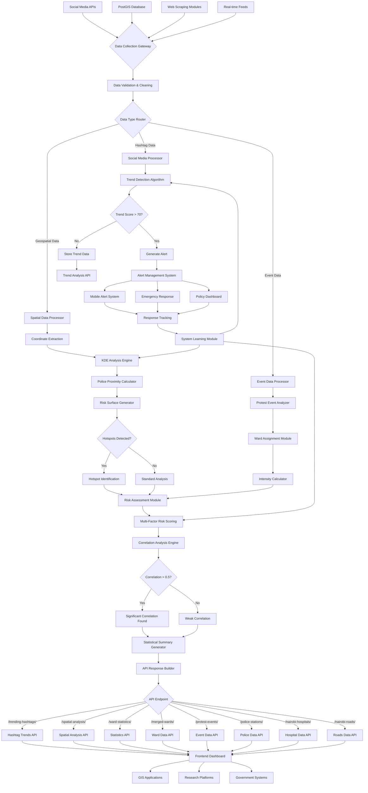
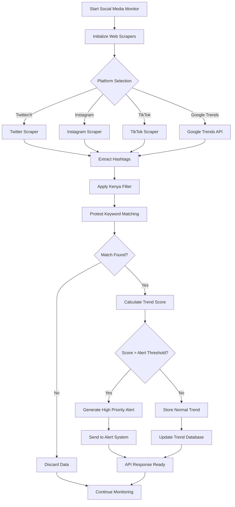
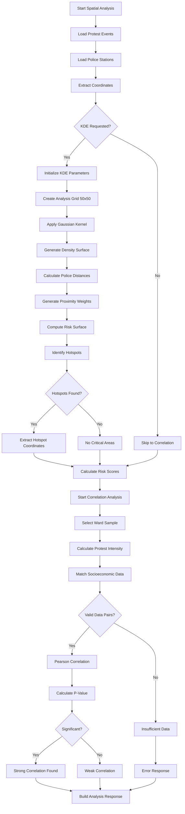
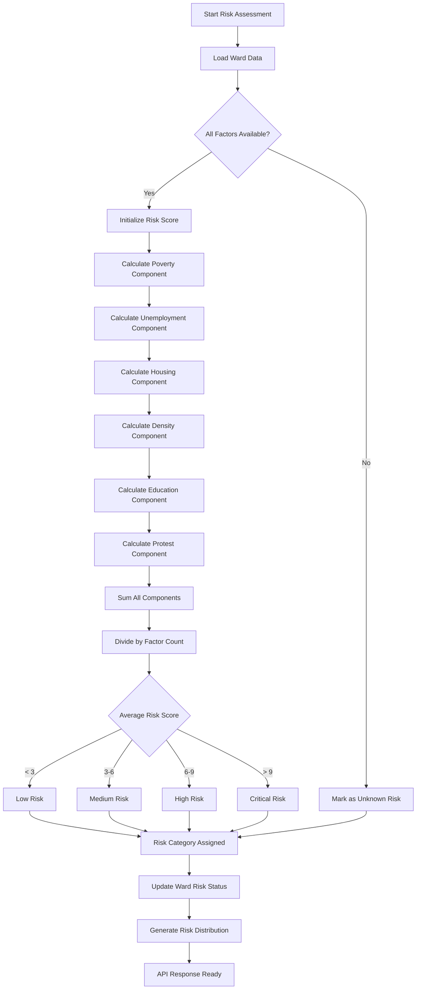
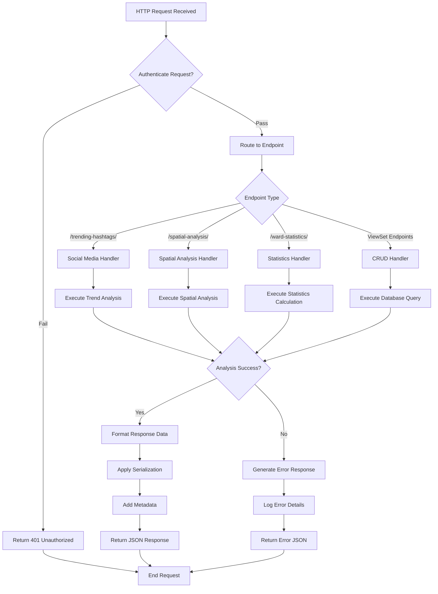
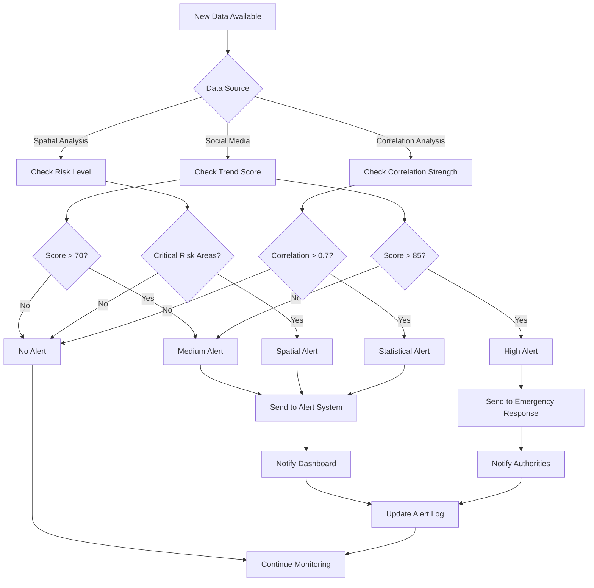
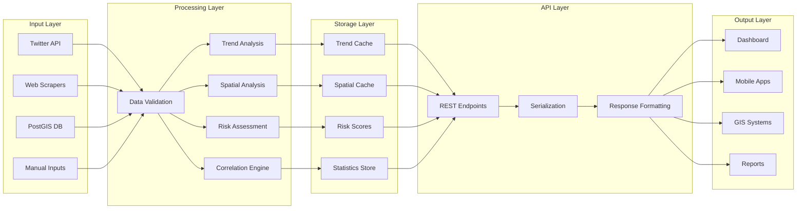
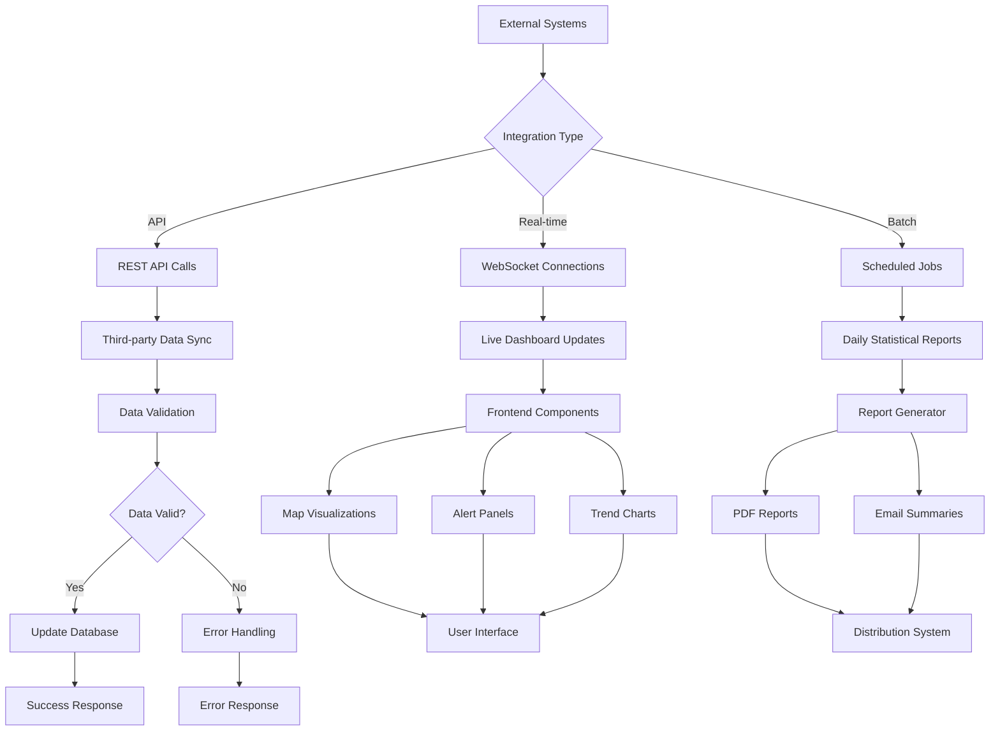

# Geospatial Protest Monitoring System - Flowchart Structure
## Complete Process Flow Diagram

### **MAIN SYSTEM FLOWCHART**

### **DETAILED SUB-PROCESS FLOWCHARTS**

#### **1. Social Media Monitoring Sub-Process**

#### **2. Spatial Analysis Sub-Process**

#### **3. Risk Assessment Sub-Process**

#### **4. API Request Flow**

### **DECISION TREE FOR ALERT GENERATION**

### **DATA FLOW ARCHITECTURE**

### **INTEGRATION POINTS FLOWCHART**

## **FLOWCHART USAGE GUIDE**

### **For Building Your Flowchart:**

1. **Start with the Main System Flowchart** - This shows the complete system overview
2. **Use Sub-Process Flowcharts** for detailed implementation of each component
3. **Include Decision Trees** for alert logic and routing
4. **Add Data Flow Architecture** to show system layers
5. **Integrate External Systems** using the integration points diagram

### **Flowchart Tools Recommendations:**

- **Mermaid.js**: For web-based diagrams (code provided above)
- **Lucidchart**: For professional flowcharts
- **Draw.io**: Free online diagramming tool
- **Microsoft Visio**: Enterprise-grade flowcharting
- **Figma**: For UI/UX focused flowcharts

### **Key Connection Points:**

1. **Data Input** → **Processing** → **Storage** → **API** → **Output**
2. **Social Media** → **Trend Detection** → **Alert Generation**
3. **Spatial Data** → **KDE Analysis** → **Risk Assessment** → **Hotspot Identification**
4. **Multiple Sources** → **Correlation Analysis** → **Statistical Insights**
5. **All Analyses** → **Unified Dashboard** → **Decision Support**

Copy the Mermaid diagrams above into any Mermaid-compatible tool to generate visual flowcharts, or use them as templates for other diagramming software!
